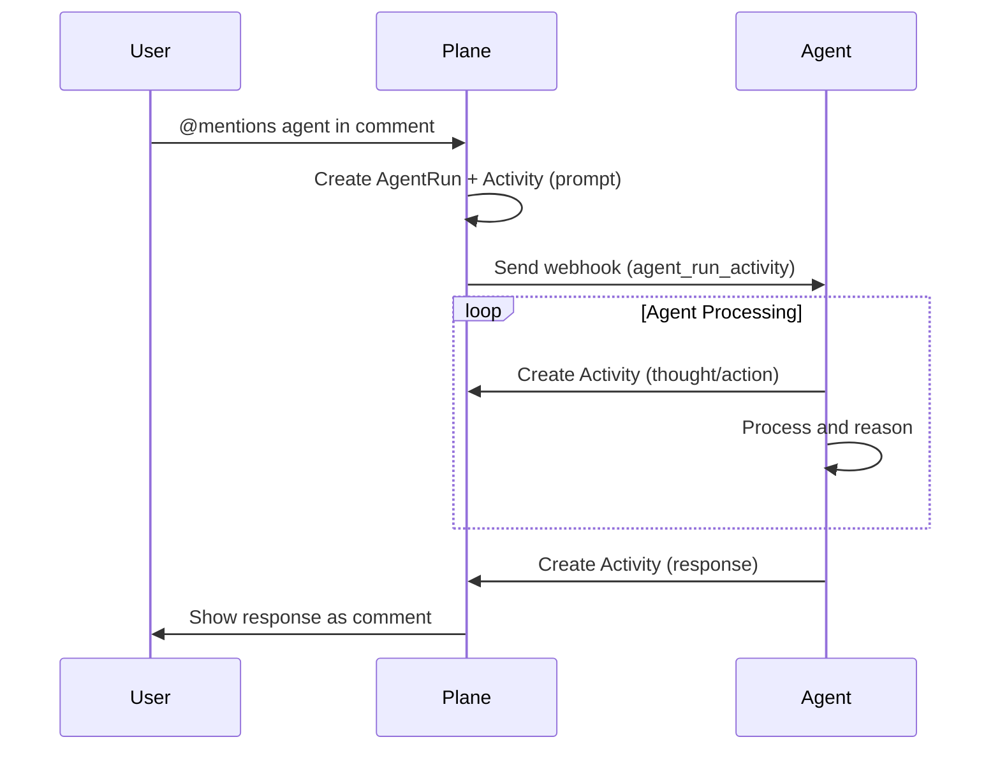

# Agents overview

::: info
Plane Agents are currently in **Beta**. Please send any feedback to support@plane.so.
:::

## What are agents in Plane?

Agents in Plane are AI-powered applications that can interact with your workspace similar to how human users do. They can be @mentioned in work item comments, receive prompts from users, and respond with intelligent actions. Agents enable automation and AI assistance directly within your project management workflow.

Key capabilities of Plane agents:

- **Mentionable** — Users can @mention agents in work item comments to trigger interactions
- **Contextual awareness** — Agents receive full context about the work item, project, and conversation
- **Activity tracking** — All agent interactions are tracked through the Agent Run system
- **Real-time responses** — Agents can send thoughts, actions, and responses back to users

## Agent installation

Agents are installed as OAuth applications in your Plane workspace. When you create an OAuth app with the **Enable App Mentions** option enabled, it becomes an agent that users can mention and interact with.

### Installation flow

1. A workspace admin installs your agent via the OAuth consent flow
2. Plane creates a **bot user** for your agent in that workspace
3. The bot user ID is returned in the app installation details
4. Users can now @mention your agent in work item comments

When installed, agents appear in the mention picker alongside regular workspace members. Users can tag them in comments just like any team member.

::: info
Agents installed in your workspace do not count as billable users.
:::

## Agent Run lifecycle

The Agent Run system tracks the complete lifecycle of an agent interaction, from when a user mentions the agent to when the agent completes its task.

### What is an Agent Run?

An **Agent Run** represents a single interaction session between a user and an agent. When a user @mentions an agent in a comment, Plane automatically creates an Agent Run to track:

- The triggering comment and work item
- The conversation thread between user and agent
- All activities (thoughts, actions, responses) from the agent
- The current status of the interaction

### What is an Agent Run Activity?

An **Agent Run Activity** is a single unit of communication within an Agent Run. Activities can be:

- **Prompt** — A message from a user to the agent
- **Thought** — Internal reasoning from the agent (ephemeral)
- **Action** — A tool invocation by the agent (ephemeral)
- **Response** — A final response from the agent (creates a comment)
- **Elicitation** — A question from the agent requesting user input
- **Error** — An error message from the agent

### How Agent Run works

The Agent Run flow consists of three main phases:

#### Phase 1: Trigger

1. User @mentions the agent in a work item comment
2. Plane detects the mention and creates a new **Agent Run**
3. An **Agent Run Activity** is created with the user's prompt
4. The Agent Run status is set to `created`

#### Phase 2: Webhook

1. Plane triggers a webhook to your agent's webhook URL
2. The webhook payload includes:
   - The Agent Run details
   - The triggering activity (user prompt)
   - Work item and project context
   - Workspace information

#### Phase 3: Agent response

1. Your agent processes the webhook and starts working
2. The agent sends activities back to Plane via the API:
   - `thought` activities to show reasoning (ephemeral, don't create comments)
   - `action` activities to show tool usage (ephemeral)
   - `response` or `elicitation` when complete (creates a comment)
3. Plane updates the Agent Run status based on activities
4. Non-ephemeral activities (response, elicitation) create comment replies visible to users

### Agent Run states

Agent Runs transition through various states based on activities:

| Status        | Description                                                       |
| ------------- | ----------------------------------------------------------------- |
| `created`     | The run has been initiated but not yet started processing         |
| `in_progress` | The agent is actively processing the request                      |
| `awaiting`    | The agent is waiting for additional input from the user           |
| `completed`   | The agent has successfully finished processing                    |
| `stopping`    | A stop request has been received and is being processed           |
| `stopped`     | The run has been successfully stopped                             |
| `failed`      | The run encountered an error and cannot continue                  |
| `stale`       | The run has not been updated in 5 minutes and is considered stale |

### Continuing a conversation

When a user replies to an agent's response:

1. If an active Agent Run exists for that thread, the reply is added as a new activity
2. The webhook is triggered again with the updated context
3. The agent can continue the conversation with full history

This enables multi-turn conversations where users and agents can have back-and-forth interactions.

## Next steps

Ready to build your own agent? Continue to [Building an Agent](/dev-tools/agents/building-an-agent) to learn how to create and deploy your first Plane agent.
