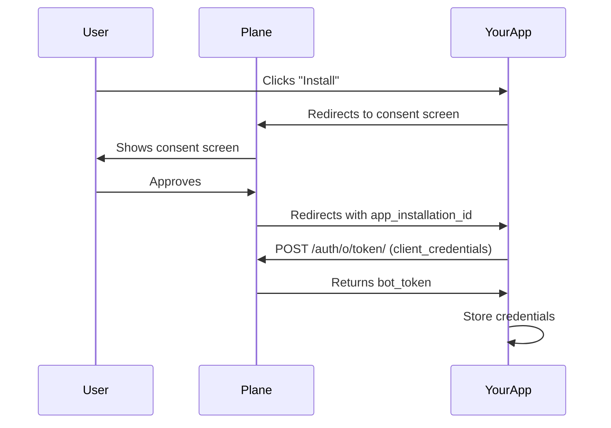
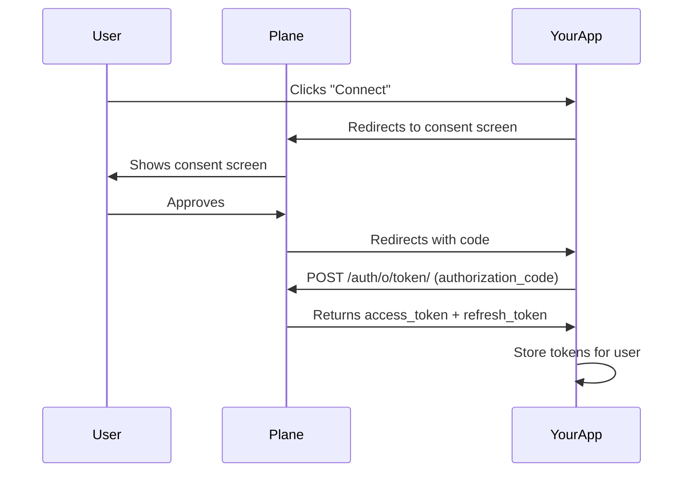

# Build a Plane App

:::info
Plane apps are currently in **Beta**. Please send any feedback to support@plane.so.
:::

## Overview

Plane uses OAuth 2.0 to allow applications to access workspace data on behalf of users or as an autonomous bot. This guide covers how to register your app and implement the OAuth flow.

## Create an OAuth Application

1. Navigate to **Workspace Settings** → **Integrations** (`https://app.plane.so/<workspace>/settings/integrations/`)
2. Click **Build your own**
3. Fill in the required details:

| Field | Description |
|-------|-------------|
| **App Name** | Display name shown to users |
| **Setup URL** | Entry point when users install your app. Your app redirects users to Plane's consent screen from here. |
| **Redirect URI** | Callback URL where Plane sends users after they approve access, along with the authorization code. |
| **Webhook URL** | Endpoint for receiving event notifications |

4. For agents that respond to @mentions, enable **"Enable App Mentions"**
5. Save and store your **Client ID** and **Client Secret** securely

:::warning
Never expose your Client Secret in client-side code or commit it to version control.
:::

## Choose Your Flow

Plane supports two OAuth flows:

| Flow | Use When | Token Type |
|------|----------|------------|
| **Bot Token** (Client Credentials) | Agents, webhooks, automation, background tasks | `bot_token` |
| **User Token** (Authorization Code) | Actions on behalf of a specific user | `access_token` |

:::info
Most integrations should use the **Bot Token flow**. Use User Token only when you need to perform actions as a specific user.
:::

---

## Bot Token Flow

Use this flow for agents, webhook handlers, and automation that acts autonomously.



### 1. Redirect to Authorization

When a user clicks "Install", redirect them to Plane's consent screen:

```
GET https://api.plane.so/auth/o/authorize-app/
  ?client_id=YOUR_CLIENT_ID
  &response_type=code
  &redirect_uri=https://your-app.com/callback
```

### 2. Handle the Callback

After the user approves, Plane redirects to your Redirect URI with:

| Parameter | Description |
|-----------|-------------|
| `app_installation_id` | Unique identifier for this installation |
| `code` | Authorization code (not used in bot flow) |

### 3. Exchange for Bot Token

```
POST https://api.plane.so/auth/o/token/
Content-Type: application/x-www-form-urlencoded
Authorization: Basic base64(client_id:client_secret)

grant_type=client_credentials
&app_installation_id=APP_INSTALLATION_ID
```

**Response:**

```json
{
  "access_token": "pln_bot_xxxxxxxxxxxx",
  "token_type": "Bearer",
  "expires_in": 86400
}
```

### 4. Get Workspace Details

```
GET https://api.plane.so/auth/o/app-installation/?id=APP_INSTALLATION_ID
Authorization: Bearer YOUR_BOT_TOKEN
```

**Response:**

```json
[
  {
    "id": "installation-uuid",
    "workspace": "workspace-uuid",
    "workspace_detail": {
      "name": "My Workspace",
      "slug": "my-workspace"
    },
    "app_bot": "bot-user-uuid",
    "status": "installed"
  }
]
```

Store the `workspace_detail.slug` for API calls and `app_installation_id` for token refresh.

### 5. Refresh Bot Token

Bot tokens expire. Request a new one using the stored `app_installation_id`:

```
POST https://api.plane.so/auth/o/token/
Content-Type: application/x-www-form-urlencoded
Authorization: Basic base64(client_id:client_secret)

grant_type=client_credentials
&app_installation_id=APP_INSTALLATION_ID
```

---

## User Token Flow

Use this flow when your app needs to act on behalf of a specific user.



### 1. Redirect to Authorization

```
GET https://api.plane.so/auth/o/authorize-app/
  ?client_id=YOUR_CLIENT_ID
  &response_type=code
  &redirect_uri=https://your-app.com/callback
  &state=RANDOM_STATE_VALUE
```

:::info
Include a random `state` parameter to prevent CSRF attacks. Verify it matches when handling the callback.
:::

### 2. Handle the Callback

After approval, Plane redirects to your Redirect URI with:

| Parameter | Description |
|-----------|-------------|
| `code` | Authorization code to exchange for tokens |
| `state` | Your state parameter (verify this matches) |

### 3. Exchange Code for Tokens

```
POST https://api.plane.so/auth/o/token/
Content-Type: application/x-www-form-urlencoded

grant_type=authorization_code
&code=AUTHORIZATION_CODE
&client_id=YOUR_CLIENT_ID
&client_secret=YOUR_CLIENT_SECRET
&redirect_uri=https://your-app.com/callback
```

**Response:**

```json
{
  "access_token": "pln_xxxxxxxxxxxx",
  "refresh_token": "pln_refresh_xxxxxxxxxxxx",
  "token_type": "Bearer",
  "expires_in": 86400
}
```

### 4. Refresh User Token

```
POST https://api.plane.so/auth/o/token/
Content-Type: application/x-www-form-urlencoded

grant_type=refresh_token
&refresh_token=YOUR_REFRESH_TOKEN
&client_id=YOUR_CLIENT_ID
&client_secret=YOUR_CLIENT_SECRET
```

---

## Making API Requests

Include the token in the `Authorization` header:

```
GET https://api.plane.so/api/v1/workspaces/{workspace_slug}/projects/
Authorization: Bearer YOUR_TOKEN
```

See the [API Reference](/api-reference) for available endpoints.

---

## Handling Webhooks

When events occur in Plane, webhooks are sent to your Webhook URL.

### Webhook Headers

| Header | Description |
|--------|-------------|
| `X-Plane-Delivery` | Unique delivery ID |
| `X-Plane-Event` | Event type (e.g., `issue`, `issue_comment`) |
| `X-Plane-Signature` | HMAC-SHA256 signature for verification |

### Verify Signature

Always verify the `X-Plane-Signature` header:

```python
import hmac
import hashlib

def verify_signature(payload: bytes, signature: str, secret: str) -> bool:
    expected = hmac.new(secret.encode(), payload, hashlib.sha256).hexdigest()
    return hmac.compare_digest(expected, signature)
```

```typescript
import crypto from 'crypto';

function verifySignature(payload: string, signature: string, secret: string): boolean {
  const expected = crypto.createHmac('sha256', secret).update(payload).digest('hex');
  return crypto.timingSafeEqual(Buffer.from(signature), Buffer.from(expected));
}
```

### Webhook Payload

```json
{
  "event": "issue",
  "action": "created",
  "webhook_id": "webhook-uuid",
  "workspace_id": "workspace-uuid",
  "data": { ... },
  "activity": {
    "actor": { "id": "user-uuid", "display_name": "John Doe" }
  }
}
```

See [Webhook Events](/dev-tools/intro-webhooks) for all event types.

---

## Local Development

For local development, use [ngrok](https://ngrok.com) to expose your server:

```bash
ngrok http 3000
```

Use the generated URL (e.g., `https://abc123.ngrok.io`) for your Setup URL, Redirect URI, and Webhook URL.

:::info
Free ngrok URLs change on restart. Update your app settings when the URL changes.
:::

---

## SDKs

Official SDKs provide OAuth helpers and typed API clients:

| Language | Package |
|----------|---------|
| Node.js | [@makeplane/plane-node-sdk](https://www.npmjs.com/package/@makeplane/plane-node-sdk) |
| Python | [plane-sdk](https://pypi.org/project/plane-sdk/) |

```bash
npm install @makeplane/plane-node-sdk
# or
pip install plane-sdk
```

<details>
<summary>SDK OAuth Helper Methods</summary>

**Node.js:**
```typescript
import { OAuthClient } from '@makeplane/plane-node-sdk';

const oauth = new OAuthClient({
  clientId: 'your_client_id',
  clientSecret: 'your_client_secret',
  redirectUri: 'https://your-app.com/callback',
});

// Generate authorization URL
const authUrl = oauth.getAuthorizationUrl('code', 'state');

// Exchange for bot token
const token = await oauth.getBotToken(appInstallationId);

// Exchange code for user token
const userToken = await oauth.exchangeCodeForToken(code);

// Refresh user token
const newToken = await oauth.getRefreshToken(refreshToken);
```

**Python:**
```python
from plane.client import OAuthClient

oauth = OAuthClient(
    client_id="your_client_id",
    client_secret="your_client_secret",
)

# Generate authorization URL
auth_url = oauth.get_authorization_url(redirect_uri="...", state="state")

# Exchange for bot token
token = oauth.get_client_credentials_token(app_installation_id=app_installation_id)

# Exchange code for user token
user_token = oauth.exchange_code(code=code, redirect_uri=redirect_uri)

# Refresh user token
new_token = oauth.refresh_token(refresh_token)
```

</details>

---

## Next Steps

<CardGroup cols="2">
  <Card title="Build an Agent" icon="robot" href="/dev-tools/agents/building-an-agent">
    Create AI agents that respond to @mentions
  </Card>
  <Card title="API Reference" icon="code" href="/api-reference">
    Explore the full Plane API
  </Card>
  <Card title="Webhook Events" icon="webhook" href="/dev-tools/intro-webhooks">
    All webhook event types
  </Card>
  <Card title="Example: PRD Agent" icon="github" href="https://github.com/makeplane/prd-agent">
    Complete agent implementation
  </Card>
</CardGroup>

---

## Complete Examples

<details>
<summary>TypeScript (Express) - Full Implementation</summary>

```typescript
import express from 'express';
import axios from 'axios';
import crypto from 'crypto';

const app = express();

const CLIENT_ID = process.env.PLANE_CLIENT_ID!;
const CLIENT_SECRET = process.env.PLANE_CLIENT_SECRET!;
const REDIRECT_URI = process.env.PLANE_REDIRECT_URI!;
const WEBHOOK_SECRET = process.env.PLANE_WEBHOOK_SECRET!;
const PLANE_API_URL = process.env.PLANE_API_URL || 'https://api.plane.so';

// In-memory storage (use a database in production)
const installations = new Map<string, {
  botToken: string;
  workspaceSlug: string;
  appInstallationId: string;
}>();

// Setup URL - redirect to Plane's consent screen
app.get('/oauth/setup', (req, res) => {
  const params = new URLSearchParams({
    client_id: CLIENT_ID,
    response_type: 'code',
    redirect_uri: REDIRECT_URI,
  });
  res.redirect(`${PLANE_API_URL}/auth/o/authorize-app/?${params}`);
});

// OAuth callback - exchange app_installation_id for bot token
app.get('/oauth/callback', async (req, res) => {
  const appInstallationId = req.query.app_installation_id as string;

  if (!appInstallationId) {
    return res.status(400).send('Missing app_installation_id');
  }

  try {
    const basicAuth = Buffer.from(`${CLIENT_ID}:${CLIENT_SECRET}`).toString('base64');

    // Exchange for bot token
    const tokenRes = await axios.post(
      `${PLANE_API_URL}/auth/o/token/`,
      new URLSearchParams({
        grant_type: 'client_credentials',
        app_installation_id: appInstallationId,
      }).toString(),
      {
        headers: {
          'Authorization': `Basic ${basicAuth}`,
          'Content-Type': 'application/x-www-form-urlencoded',
        },
      }
    );

    const botToken = tokenRes.data.access_token;

    // Get workspace details
    const installRes = await axios.get(
      `${PLANE_API_URL}/auth/o/app-installation/?id=${appInstallationId}`,
      { headers: { 'Authorization': `Bearer ${botToken}` } }
    );

    const installation = installRes.data[0];
    const workspaceId = installation.workspace;
    const workspaceSlug = installation.workspace_detail.slug;

    // Store credentials
    installations.set(workspaceId, { botToken, workspaceSlug, appInstallationId });

    console.log(`Installed in workspace: ${workspaceSlug}`);
    res.send('Installation successful! You can close this window.');

  } catch (error) {
    console.error('OAuth error:', error);
    res.status(500).send('Installation failed');
  }
});

// Webhook handler
app.post('/webhook', express.raw({ type: 'application/json' }), (req, res) => {
  const signature = req.headers['x-plane-signature'] as string;
  const payload = req.body.toString();

  // Verify signature
  const expected = crypto.createHmac('sha256', WEBHOOK_SECRET).update(payload).digest('hex');
  if (!crypto.timingSafeEqual(Buffer.from(signature || ''), Buffer.from(expected))) {
    return res.status(403).send('Invalid signature');
  }

  const event = JSON.parse(payload);
  console.log(`Received: ${event.event} ${event.action}`);

  // Get credentials for this workspace
  const creds = installations.get(event.workspace_id);
  if (creds) {
    // Process the event with creds.botToken
  }

  res.status(200).send('OK');
});

app.listen(3000, () => console.log('Server running on http://localhost:3000'));
```

</details>

<details>
<summary>Python (Flask) - Full Implementation</summary>

```python
import os
import hmac
import hashlib
import base64
import requests as http_requests
from flask import Flask, request, redirect
from urllib.parse import urlencode

app = Flask(__name__)

CLIENT_ID = os.getenv("PLANE_CLIENT_ID")
CLIENT_SECRET = os.getenv("PLANE_CLIENT_SECRET")
REDIRECT_URI = os.getenv("PLANE_REDIRECT_URI")
WEBHOOK_SECRET = os.getenv("PLANE_WEBHOOK_SECRET")
PLANE_API_URL = os.getenv("PLANE_API_URL", "https://api.plane.so")

# In-memory storage (use a database in production)
installations = {}


@app.route("/oauth/setup")
def oauth_setup():
    """Redirect to Plane's consent screen."""
    params = urlencode({
        "client_id": CLIENT_ID,
        "response_type": "code",
        "redirect_uri": REDIRECT_URI,
    })
    return redirect(f"{PLANE_API_URL}/auth/o/authorize-app/?{params}")


@app.route("/oauth/callback")
def oauth_callback():
    """Exchange app_installation_id for bot token."""
    app_installation_id = request.args.get("app_installation_id")

    if not app_installation_id:
        return "Missing app_installation_id", 400

    try:
        # Exchange for bot token
        credentials = f"{CLIENT_ID}:{CLIENT_SECRET}"
        basic_auth = base64.b64encode(credentials.encode()).decode()

        token_response = http_requests.post(
            f"{PLANE_API_URL}/auth/o/token/",
            data={
                "grant_type": "client_credentials",
                "app_installation_id": app_installation_id,
            },
            headers={
                "Authorization": f"Basic {basic_auth}",
                "Content-Type": "application/x-www-form-urlencoded",
            },
        )
        token_response.raise_for_status()
        bot_token = token_response.json()["access_token"]

        # Get workspace details
        install_response = http_requests.get(
            f"{PLANE_API_URL}/auth/o/app-installation/",
            params={"id": app_installation_id},
            headers={"Authorization": f"Bearer {bot_token}"},
        )
        install_response.raise_for_status()
        installation = install_response.json()[0]

        workspace_id = installation["workspace"]
        workspace_slug = installation["workspace_detail"]["slug"]

        # Store credentials
        installations[workspace_id] = {
            "bot_token": bot_token,
            "workspace_slug": workspace_slug,
            "app_installation_id": app_installation_id,
        }

        print(f"Installed in workspace: {workspace_slug}")
        return "Installation successful! You can close this window."

    except Exception as e:
        print(f"OAuth error: {e}")
        return "Installation failed", 500


@app.route("/webhook", methods=["POST"])
def webhook():
    """Handle incoming webhooks."""
    signature = request.headers.get("X-Plane-Signature", "")
    payload = request.get_data()

    # Verify signature
    expected = hmac.new(
        WEBHOOK_SECRET.encode(), payload, hashlib.sha256
    ).hexdigest()

    if not hmac.compare_digest(expected, signature):
        return "Invalid signature", 403

    event = request.get_json()
    print(f"Received: {event['event']} {event['action']}")

    # Get credentials for this workspace
    creds = installations.get(event["workspace_id"])
    if creds:
        # Process the event with creds["bot_token"]
        pass

    return "OK", 200


if __name__ == "__main__":
    app.run(port=3000)
```

</details>

---

## Publish to Marketplace

Apps can be listed on the [Plane Marketplace](https://plane.so/marketplace/integrations). Contact [support@plane.so](mailto:support@plane.so) to list your app.
