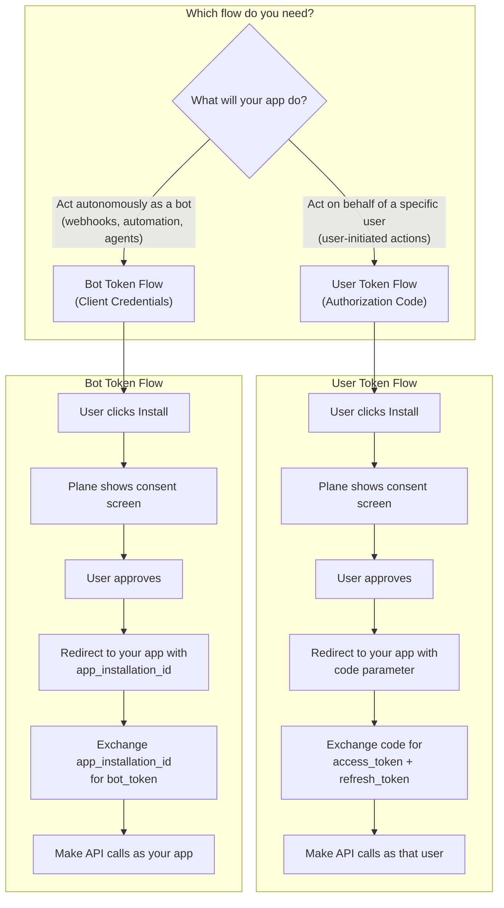
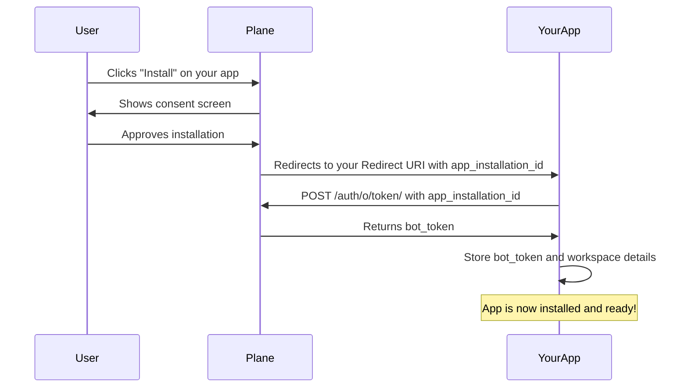
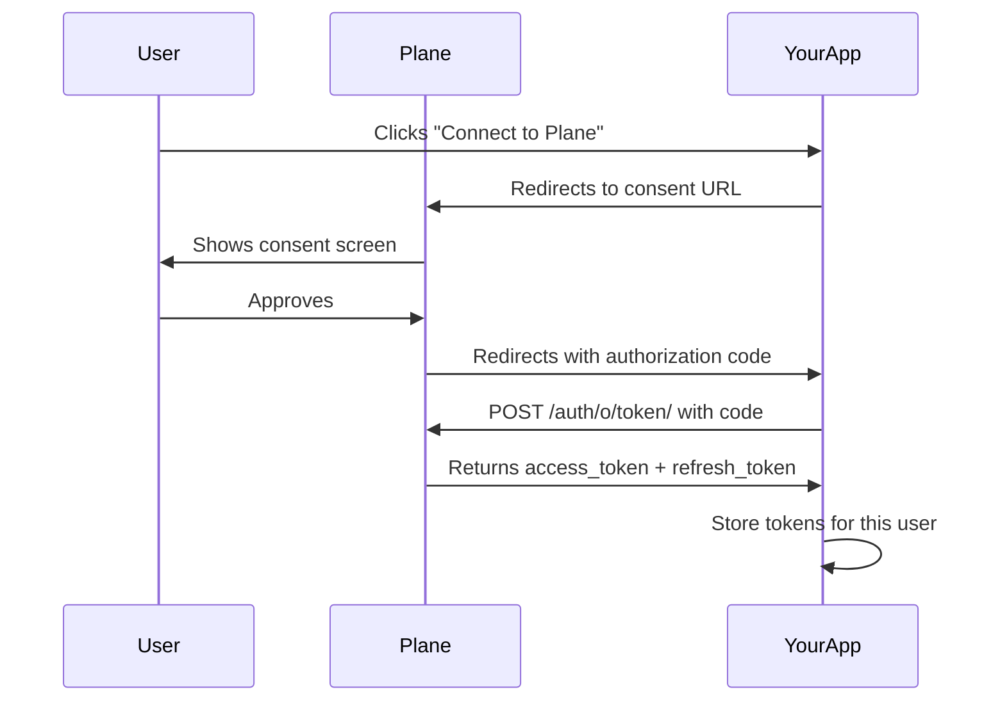
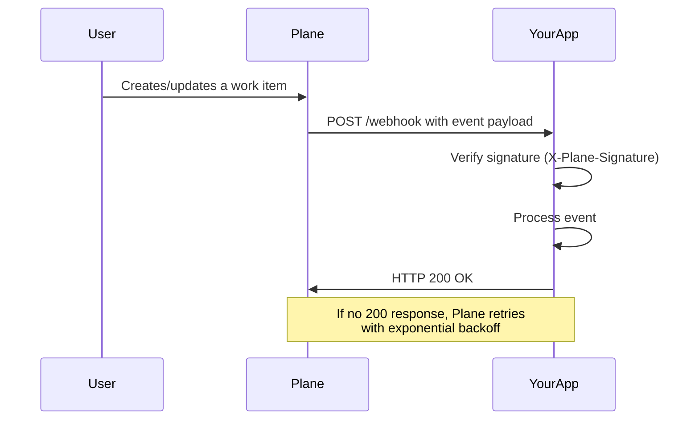

# Build a Plane app (Beta)

:::info
Plane apps are currently in **Beta**. Please send any feedback to support@plane.so.
:::

## Introduction

Plane apps seamlessly integrate tools and services with Plane so you can
use them without ever leaving your Workspace. Apps are conveniently available
from our [marketplace](https://plane.so/marketplace/integrations), helping you
stay focused and productive.

## Why Build a Plane App?

**Stop doing manual work.**
Plane integrations eliminate repetitive tasks like copying updates between
tools, creating work items from support tickets, and generating status reports.
Instead of spending hours on administrative work, let your app handle it
automatically.

**Connect everything you already use.**
Your team probably uses dozens of different tools. Plane apps create a unified
workflow by connecting your favorite CRM, time tracking app, CI/CD pipelines,
communication tools, and more, together into Plane. One change in Plane can
trigger updates across your entire tech stack.

**Build exactly what you need.**
Unlike rigid SaaS platforms, Plane's open core nature means you can create
integrations that fit your specific workflow.

## Prerequisites

Before you start building, make sure you have:

- A [Plane Cloud](https://app.plane.so) workspace (or a self-hosted Plane instance)
- **Admin access** to your workspace settings (required to create apps)
- A server or serverless function to handle OAuth callbacks and webhooks
- Basic knowledge of HTTP APIs and your preferred programming language

<details>
<summary>New to OAuth? Here's a quick overview</summary>

OAuth is an authorization protocol that lets users grant your app access to their Plane data without sharing their password. Here's how it works:

1. **User clicks "Install"** — They're redirected to Plane's consent screen
2. **User approves** — Plane redirects back to your app with an authorization code
3. **Your app exchanges the code** — You send the code to Plane and receive access tokens
4. **You make API calls** — Use the tokens to call Plane's API on behalf of the user or app

**Key URLs you'll configure:**

| URL | Purpose |
|-----|---------|
| **Setup URL** | The entry point for your app. When users install your app, they visit this URL first. Your app uses it to generate and redirect users to Plane's consent screen. |
| **Redirect URL** | Where Plane sends users after they approve (or deny) access. This is your callback endpoint that receives the authorization code, which you then exchange for tokens. |

You don't need to be an OAuth expert to build a Plane app—our SDKs handle most of the complexity for you.

</details>

## Official SDKs

Plane provides official SDKs that include OAuth helpers and API clients. While this guide shows raw API calls for clarity, the SDKs can simplify your implementation.

:::tabs key:sdk-install
== Node.js

```bash
npm install @makeplane/plane-node-sdk
```

== Python

```bash
pip install plane-sdk
```

:::

| Language | Package | Source Code |
|----------|---------|-------------|
| Node.js | [@makeplane/plane-node-sdk](https://www.npmjs.com/package/@makeplane/plane-node-sdk) | [GitHub](https://github.com/makeplane/plane-node-sdk) |
| Python | [plane-sdk](https://pypi.org/project/plane-sdk/) | [GitHub](https://github.com/makeplane/plane-python-sdk) |

<details>
<summary>SDK OAuth Helper Methods</summary>

Both SDKs provide an `OAuthClient` class with helper methods for OAuth flows:

**Node.js SDK:**
```typescript
import { OAuthClient } from '@makeplane/plane-node-sdk';

const oauthClient = new OAuthClient({
  baseUrl: 'https://api.plane.so',  // Optional, defaults to https://api.plane.so
  clientId: 'your_client_id',
  clientSecret: 'your_client_secret',
  redirectUri: 'https://your-app.com/oauth/callback',
});

// Generate authorization URL
const authUrl = oauthClient.getAuthorizationUrl('code', 'optional-state');

// Exchange code for user token (authorization code flow)
const token = await oauthClient.exchangeCodeForToken(code);

// Get bot token for app installations (client credentials flow)
const botTokenResponse = await oauthClient.getBotToken(appInstallationId);

// Refresh user token
const newToken = await oauthClient.getRefreshToken(refreshToken);

// Get app installation details
const installations = await oauthClient.getAppInstallations(token.access_token, appInstallationId);
```

**Python SDK:**
```python
from plane.client import OAuthClient

oauth_client = OAuthClient(
    base_url="https://api.plane.so",
    client_id="your_client_id",
    client_secret="your_client_secret",
)

# Generate authorization URL
auth_url = oauth_client.get_authorization_url(
    redirect_uri="https://your-app.com/oauth/callback",
    state="optional-state"
)

# Exchange code for user token (authorization code flow)
token = oauth_client.exchange_code(code=code, redirect_uri=redirect_uri)

# Get bot token for app installations (client credentials flow)
bot_token = oauth_client.get_client_credentials_token(app_installation_id=app_installation_id)

# Refresh user token
new_token = oauth_client.refresh_token(refresh_token)
```

</details>

## Understanding OAuth Flows

Plane supports two OAuth flows depending on what your app needs to do:



### Which Flow Should I Use?

| Use Case | Flow | Token Type |
|----------|------|------------|
| **Agents** that respond to @mentions | Bot Token | `bot_token` |
| **Automation** triggered by webhooks | Bot Token | `bot_token` |
| **Background sync** with external services | Bot Token | `bot_token` |
| **User dashboards** showing personalized data | User Token | `access_token` |
| **Actions on behalf of a user** (e.g., "Create work item as me") | User Token | `access_token` |

:::info
Most apps that respond to webhooks or act as agents should use the **Bot Token Flow**. Use the User Token Flow only when you need to perform actions as a specific user.
:::

## High-Level Workflow

1. [Register your app](#registering-your-app) on the Plane developer portal
2. [Set up your server](#deployment--local-development) to handle OAuth callbacks and webhooks
3. [Implement the OAuth flow](#implement-oauth-flow) to get access tokens
4. [Handle webhooks](#webhook-payload-structure) to respond to events
5. [Make API calls](#make-authenticated-api-requests-to-plane) using your tokens
6. [Handle token refresh](#handle-token-refresh) when tokens expire

## Registering Your App

To create an OAuth application with Plane:

1. Navigate to `https://app.plane.so/<workspace_slug>/settings/integrations/`
2. Click on the **Build your own** button
3. Fill out the form with the required details:

| Field | Description | Example |
|-------|-------------|---------|
| **App Name** | Display name for your app | `My Integration` |
| **Setup URL** | URL users visit when clicking "Install" (initiates OAuth) | `https://your-app.com/oauth/setup` |
| **Redirect URIs** | Where Plane sends the authorization code after consent | `https://your-app.com/oauth/callback` |
| **Webhook URL** | Your endpoint for receiving event notifications | `https://your-app.com/webhook` |
| **Contact Details** | Your email for support inquiries | `dev@yourcompany.com` |

4. **For agents**: Enable the **"Enable App Mentions"** checkbox. This allows users to @mention your app in comments.

5. Click **Save**. You'll receive a **Client ID** and **Client Secret**.

:::warning
Store your **Client Secret** securely. Never commit it to version control or expose it in client-side code.
:::

## Deployment & Local Development

Your app needs a publicly accessible HTTPS endpoint to receive OAuth callbacks and webhooks from Plane.

### Local Development with ngrok

For local development, use [ngrok](https://ngrok.com) to expose your local server:

```bash
# Start your local server (example: running on port 3000)
npm run dev

# In another terminal, expose it via ngrok
ngrok http 3000
```

ngrok will give you a public URL like `https://abc123.ngrok.io`. Use this as your base URL when registering your app:

| Field | Local Development URL |
|-------|----------------------|
| Setup URL | `https://abc123.ngrok.io/oauth/setup` |
| Redirect URI | `https://abc123.ngrok.io/oauth/callback` |
| Webhook URL | `https://abc123.ngrok.io/webhook` |

:::info
The ngrok URL changes each time you restart ngrok (unless you have a paid plan). Update your app's URLs in Plane settings when the URL changes.
:::

### Production Deployment

For production, deploy your app to a hosting platform with HTTPS support:

| Platform | Best For | Setup Complexity |
|----------|----------|------------------|
| [Cloudflare Workers](https://workers.cloudflare.com) | Serverless, global edge | Low |
| [Vercel](https://vercel.com) | Node.js serverless functions | Low |
| [Railway](https://railway.app) | Full-stack apps | Low |
| [AWS Lambda](https://aws.amazon.com/lambda/) | Enterprise, high scale | Medium |
| Traditional VPS | Full control | Higher |

:::tip
Check out the [PRD Agent example](https://github.com/makeplane/prd-agent) for a complete Cloudflare Workers implementation.
:::

## Implement OAuth Flow

### Bot Token Flow (Recommended for Agents & Automation)

Use this flow when your app needs to act autonomously—responding to webhooks, running as an agent, or performing background tasks.

**How it works:**



When a user installs your app, Plane redirects to your Redirect URI with these parameters:

| Parameter | Description |
|-----------|-------------|
| `app_installation_id` | Unique identifier for this installation |
| `code` | Authorization code (not used in bot flow) |

**Implementation:**

:::tabs key:bot-token-impl
== TypeScript

```typescript
import express from 'express';
import axios from 'axios';

const app = express();

// Environment variables
const CLIENT_ID = process.env.PLANE_CLIENT_ID!;
const CLIENT_SECRET = process.env.PLANE_CLIENT_SECRET!;
const REDIRECT_URI = process.env.PLANE_REDIRECT_URI!;
const PLANE_API_URL = process.env.PLANE_API_URL || 'https://api.plane.so';

// OAuth callback handler
app.get('/oauth/callback', async (req, res) => {
  const appInstallationId = req.query.app_installation_id as string;

  if (!appInstallationId) {
    return res.status(400).send('Missing app_installation_id');
  }

  try {
    // Exchange app_installation_id for bot token
    const basicAuth = Buffer.from(`${CLIENT_ID}:${CLIENT_SECRET}`).toString('base64');

    const tokenResponse = await axios.post(
      `${PLANE_API_URL}/auth/o/token/`,
      new URLSearchParams({
        grant_type: 'client_credentials',
        app_installation_id: appInstallationId,
      }).toString(),
      {
        headers: {
          'Authorization': `Basic ${basicAuth}`,
          'Content-Type': 'application/x-www-form-urlencoded',
        },
      }
    );

    const botToken = tokenResponse.data.access_token;
    const expiresIn = tokenResponse.data.expires_in;

    // Fetch workspace details
    const installationResponse = await axios.get(
      `${PLANE_API_URL}/auth/o/app-installation/?id=${appInstallationId}`,
      {
        headers: { 'Authorization': `Bearer ${botToken}` },
      }
    );

    const installation = installationResponse.data[0];
    const workspaceSlug = installation.workspace_detail.slug;
    const workspaceId = installation.workspace;
    const botUserId = installation.app_bot;

    // TODO: Store these securely in your database
    // - appInstallationId (for token refresh)
    // - botToken
    // - expiresIn
    // - workspaceSlug
    // - workspaceId
    // - botUserId

    console.log(`App installed in workspace: ${workspaceSlug}`);

    // Redirect user to success page
    res.redirect(`https://app.plane.so/${workspaceSlug}?installation=success`);

  } catch (error) {
    console.error('OAuth error:', error);
    res.status(500).send('Installation failed');
  }
});

app.listen(3000, () => console.log('Server running on port 3000'));
```

== Python

```python
import os
import base64
import requests
from flask import Flask, request, redirect

app = Flask(__name__)

# Environment variables
CLIENT_ID = os.getenv("PLANE_CLIENT_ID")
CLIENT_SECRET = os.getenv("PLANE_CLIENT_SECRET")
REDIRECT_URI = os.getenv("PLANE_REDIRECT_URI")
PLANE_API_URL = os.getenv("PLANE_API_URL", "https://api.plane.so")

@app.route("/oauth/callback")
def oauth_callback():
    app_installation_id = request.args.get("app_installation_id")

    if not app_installation_id:
        return "Missing app_installation_id", 400

    try:
        # Exchange app_installation_id for bot token
        credentials = f"{CLIENT_ID}:{CLIENT_SECRET}"
        basic_auth = base64.b64encode(credentials.encode()).decode()

        token_response = requests.post(
            f"{PLANE_API_URL}/auth/o/token/",
            data={
                "grant_type": "client_credentials",
                "app_installation_id": app_installation_id,
            },
            headers={
                "Authorization": f"Basic {basic_auth}",
                "Content-Type": "application/x-www-form-urlencoded",
            },
        )
        token_response.raise_for_status()
        token_data = token_response.json()

        bot_token = token_data["access_token"]
        expires_in = token_data.get("expires_in")

        # Fetch workspace details
        installation_response = requests.get(
            f"{PLANE_API_URL}/auth/o/app-installation/",
            params={"id": app_installation_id},
            headers={"Authorization": f"Bearer {bot_token}"},
        )
        installation_response.raise_for_status()
        installations = installation_response.json()

        if not installations:
            return "Installation not found", 404

        installation = installations[0]
        workspace_slug = installation["workspace_detail"]["slug"]
        workspace_id = installation["workspace"]
        bot_user_id = installation["app_bot"]

        # TODO: Store these securely in your database
        # - app_installation_id (for token refresh)
        # - bot_token
        # - expires_in
        # - workspace_slug
        # - workspace_id
        # - bot_user_id

        print(f"App installed in workspace: {workspace_slug}")

        # Redirect user to success page
        return redirect(f"https://app.plane.so/{workspace_slug}?installation=success")

    except Exception as e:
        print(f"OAuth error: {e}")
        return "Installation failed", 500

if __name__ == "__main__":
    app.run(port=3000)
```

:::

### User Token Flow (For User-Specific Actions)

Use this flow when your app needs to act on behalf of a specific user.

**How it works:**



Plane redirects to your Redirect URI with these parameters:

| Parameter | Description | Required |
|-----------|-------------|----------|
| `code` | Authorization code to exchange for tokens | Yes |
| `state` | Your state parameter (for CSRF protection) | No |

**Generating the Consent URL:**

:::tabs key:consent-url
== TypeScript

```typescript
const PLANE_API_URL = process.env.PLANE_API_URL || 'https://api.plane.so';

const params = new URLSearchParams({
  client_id: process.env.PLANE_CLIENT_ID!,
  response_type: 'code',
  redirect_uri: process.env.PLANE_REDIRECT_URI!,
  state: 'random-csrf-token', // Generate a secure random string
});

const consentUrl = `${PLANE_API_URL}/auth/o/authorize-app/?${params.toString()}`;
// Redirect the user to consentUrl
```

== Python

```python
from urllib.parse import urlencode

PLANE_API_URL = os.getenv("PLANE_API_URL", "https://api.plane.so")

params = {
    "client_id": os.getenv("PLANE_CLIENT_ID"),
    "response_type": "code",
    "redirect_uri": os.getenv("PLANE_REDIRECT_URI"),
    "state": "random-csrf-token",  # Generate a secure random string
}

consent_url = f"{PLANE_API_URL}/auth/o/authorize-app/?{urlencode(params)}"
# Redirect the user to consent_url
```

:::

**Exchanging the Code for Tokens:**

:::tabs key:code-exchange
== TypeScript

```typescript
app.get('/oauth/callback', async (req, res) => {
  const code = req.query.code as string;
  const state = req.query.state as string;

  // TODO: Verify state matches what you sent

  const response = await axios.post(
    `${PLANE_API_URL}/auth/o/token/`,
    new URLSearchParams({
      grant_type: 'authorization_code',
      code: code,
      client_id: CLIENT_ID,
      client_secret: CLIENT_SECRET,
      redirect_uri: REDIRECT_URI,
    }).toString(),
    {
      headers: { 'Content-Type': 'application/x-www-form-urlencoded' },
    }
  );

  const accessToken = response.data.access_token;
  const refreshToken = response.data.refresh_token;
  const expiresIn = response.data.expires_in;

  // Store tokens securely for this user
});
```

== Python

```python
@app.route("/oauth/callback")
def oauth_callback():
    code = request.args.get("code")
    state = request.args.get("state")

    # TODO: Verify state matches what you sent

    token_response = requests.post(
        f"{PLANE_API_URL}/auth/o/token/",
        data={
            "grant_type": "authorization_code",
            "code": code,
            "client_id": CLIENT_ID,
            "client_secret": CLIENT_SECRET,
            "redirect_uri": REDIRECT_URI,
        },
        headers={"Content-Type": "application/x-www-form-urlencoded"},
    )
    token_response.raise_for_status()
    token_data = token_response.json()

    access_token = token_data["access_token"]
    refresh_token = token_data.get("refresh_token")
    expires_in = token_data.get("expires_in")

    # Store tokens securely for this user
```

:::

### Fetching App Installation Details

After obtaining a token, fetch the installation details to get the workspace information:

```json
// GET https://api.plane.so/auth/o/app-installation/?id={app_installation_id}
// Response:
[
  {
    "id": "34b97361-8636-43dc-953e-90deedc8498f",
    "workspace_detail": {
      "name": "My Workspace",
      "slug": "my-workspace",
      "id": "7a2e5944-c117-4a7d-b5f4-058fe705d7d1"
    },
    "status": "installed",
    "app_bot": "7286aaa7-9250-4851-a520-29c904fd7654",
    "workspace": "7a2e5944-c117-4a7d-b5f4-058fe705d7d1"
  }
]
```

**Key fields:**

| Field | Description | Use For |
|-------|-------------|---------|
| `workspace_detail.slug` | Workspace slug | API calls (e.g., `/api/v1/workspaces/{slug}/...`) |
| `workspace` | Workspace UUID | Identifying webhooks from this workspace |
| `app_bot` | Bot user UUID | Your app's identity in this workspace |
| `status` | Installation status | Should be `"installed"` |

## Webhook Payload Structure

When events occur in Plane, webhooks are sent to your Webhook URL. Here's the flow:



### Webhook Headers

Every webhook includes these headers:

| Header | Description |
|--------|-------------|
| `X-Plane-Delivery` | Unique ID for this webhook delivery |
| `X-Plane-Event` | Event type (e.g., `issue`, `issue_comment`, `project`) |
| `X-Plane-Signature` | HMAC signature for verification |

### Verifying Webhook Signatures

Always verify the `X-Plane-Signature` to ensure webhooks are from Plane. See [Webhook Signature Verification](/dev-tools/intro-webhooks#verifying-signature) for details.

:::tabs key:webhook-verify
== TypeScript

```typescript
import crypto from 'crypto';

function verifyWebhookSignature(
  payload: string,
  signature: string,
  secret: string
): boolean {
  const expectedSignature = crypto
    .createHmac('sha256', secret)
    .update(payload)
    .digest('hex');

  return crypto.timingSafeEqual(
    Buffer.from(signature),
    Buffer.from(expectedSignature)
  );
}

app.post('/webhook', express.raw({ type: 'application/json' }), (req, res) => {
  const signature = req.headers['x-plane-signature'] as string;
  const payload = req.body.toString();

  if (!verifyWebhookSignature(payload, signature, WEBHOOK_SECRET)) {
    return res.status(403).send('Invalid signature');
  }

  const event = JSON.parse(payload);
  // Process the event...

  res.status(200).send('OK');
});
```

== Python

```python
import hashlib
import hmac

def verify_webhook_signature(payload: bytes, signature: str, secret: str) -> bool:
    expected_signature = hmac.new(
        secret.encode('utf-8'),
        msg=payload,
        digestmod=hashlib.sha256
    ).hexdigest()

    return hmac.compare_digest(expected_signature, signature)

@app.route("/webhook", methods=["POST"])
def handle_webhook():
    signature = request.headers.get("X-Plane-Signature")
    payload = request.get_data()

    if not verify_webhook_signature(payload, signature, WEBHOOK_SECRET):
        return "Invalid signature", 403

    event = request.get_json()
    # Process the event...

    return "OK", 200
```

:::

### Webhook Payload Structure

All webhooks follow this structure:

```json
{
  "event": "issue",              // Event type
  "action": "updated",           // Action: created, updated, deleted
  "webhook_id": "uuid",          // Webhook configuration ID
  "workspace_id": "uuid",        // Workspace where event occurred
  "data": {                      // Event-specific data
    "id": "work-item-uuid",
    "name": "Work Item Title",
    // ... other fields
  },
  "activity": {                  // Who performed the action
    "actor": {
      "id": "user-uuid",
      "display_name": "John Doe",
      "email": "john@example.com"
    },
    "field": "priority",         // Changed field (for updates)
    "old_value": "medium",
    "new_value": "high"
  }
}
```

### Common Event Types

| Event | Actions | Description |
|-------|---------|-------------|
| `issue` | created, updated, deleted | Work item changes |
| `issue_comment` | created, updated, deleted | Comment changes |
| `project` | created, updated, deleted | Project changes |
| `cycle` | created, updated, deleted | Cycle changes |
| `module` | created, updated, deleted | Module changes |

### Processing Webhooks

:::tabs key:webhook-process
== TypeScript

```typescript
interface WebhookPayload {
  event: string;
  action: string;
  webhook_id: string;
  workspace_id: string;
  data: Record<string, any>;
  activity: {
    actor: { id: string; display_name: string; email?: string };
    field?: string;
    old_value?: any;
    new_value?: any;
  };
}

async function processWebhook(payload: WebhookPayload) {
  // Get stored credentials for this workspace
  const credentials = await getCredentialsForWorkspace(payload.workspace_id);
  if (!credentials) {
    throw new Error(`No credentials for workspace ${payload.workspace_id}`);
  }

  // Handle different event types
  switch (payload.event) {
    case 'issue':
      if (payload.action === 'created') {
        await handleNewIssue(payload.data, credentials);
      }
      break;

    case 'issue_comment':
      if (payload.action === 'created') {
        await handleNewComment(payload.data, credentials);
      }
      break;
  }
}
```

== Python

```python
def process_webhook(payload: dict):
    # Get stored credentials for this workspace
    credentials = get_credentials_for_workspace(payload["workspace_id"])
    if not credentials:
        raise Exception(f"No credentials for workspace {payload['workspace_id']}")

    # Handle different event types
    if payload["event"] == "issue":
        if payload["action"] == "created":
            handle_new_issue(payload["data"], credentials)

    elif payload["event"] == "issue_comment":
        if payload["action"] == "created":
            handle_new_comment(payload["data"], credentials)
```

:::

## Make Authenticated API Requests to Plane

Once you have a token, use it to call Plane's API. Include the token in the `Authorization` header:

:::tabs key:api-requests
== TypeScript

```typescript
// Using axios directly
const response = await axios.get(
  `${PLANE_API_URL}/api/v1/workspaces/${workspaceSlug}/projects/${projectId}/issues/`,
  {
    headers: { 'Authorization': `Bearer ${botToken}` },
  }
);
const workItems = response.data;

// Create a work item
const newWorkItem = await axios.post(
  `${PLANE_API_URL}/api/v1/workspaces/${workspaceSlug}/projects/${projectId}/issues/`,
  {
    name: 'New work item from my app',
    description_html: '<p>Created via API</p>',
  },
  {
    headers: { 'Authorization': `Bearer ${botToken}` },
  }
);
```

== Python

```python
# Using requests directly
response = requests.get(
    f"{PLANE_API_URL}/api/v1/workspaces/{workspace_slug}/projects/{project_id}/issues/",
    headers={"Authorization": f"Bearer {bot_token}"},
)
response.raise_for_status()
work_items = response.json()

# Create a work item
new_work_item = requests.post(
    f"{PLANE_API_URL}/api/v1/workspaces/{workspace_slug}/projects/{project_id}/issues/",
    json={
        "name": "New work item from my app",
        "description_html": "<p>Created via API</p>",
    },
    headers={"Authorization": f"Bearer {bot_token}"},
)
new_work_item.raise_for_status()
```

:::

:::tip
The official SDKs provide typed clients for API calls. See the [SDK OAuth Helper Methods](#official-sdks) section above for installation details.

```typescript
// Using Node.js SDK
import { PlaneClient } from '@makeplane/plane-node-sdk';
const client = new PlaneClient({ baseUrl: PLANE_API_URL, accessToken: botToken });
const workItems = await client.workItems.list(workspaceSlug, projectId);
```

```python
# Using Python SDK
from plane import PlaneClient
client = PlaneClient(base_url=PLANE_API_URL, access_token=bot_token)
work_items = client.work_items.list(workspace_slug, project_id)
```
:::

API reference is available at [https://docs.plane.so/api-reference](https://docs.plane.so/api-reference).

## Handle Token Refresh

Tokens expire and need to be refreshed. The method depends on which flow you used:

### Bot Token Refresh

Bot tokens don't use refresh tokens. When expired, request a new one using the stored `app_installation_id`:

:::tabs key:bot-refresh
== TypeScript

```typescript
async function refreshBotToken(appInstallationId: string): Promise<string> {
  const basicAuth = Buffer.from(`${CLIENT_ID}:${CLIENT_SECRET}`).toString('base64');

  const response = await axios.post(
    `${PLANE_API_URL}/auth/o/token/`,
    new URLSearchParams({
      grant_type: 'client_credentials',
      app_installation_id: appInstallationId,
    }).toString(),
    {
      headers: {
        'Authorization': `Basic ${basicAuth}`,
        'Content-Type': 'application/x-www-form-urlencoded',
      },
    }
  );

  return response.data.access_token;
}
```

== Python

```python
def refresh_bot_token(app_installation_id: str) -> str:
    credentials = f"{CLIENT_ID}:{CLIENT_SECRET}"
    basic_auth = base64.b64encode(credentials.encode()).decode()

    response = requests.post(
        f"{PLANE_API_URL}/auth/o/token/",
        data={
            "grant_type": "client_credentials",
            "app_installation_id": app_installation_id,
        },
        headers={
            "Authorization": f"Basic {basic_auth}",
            "Content-Type": "application/x-www-form-urlencoded",
        },
    )
    response.raise_for_status()
    return response.json()["access_token"]
```

:::

### User Token Refresh

Use the stored `refresh_token` to get a new `access_token`:

:::tabs key:user-refresh
== TypeScript

```typescript
async function refreshUserToken(refreshToken: string) {
  const response = await axios.post(
    `${PLANE_API_URL}/auth/o/token/`,
    new URLSearchParams({
      grant_type: 'refresh_token',
      refresh_token: refreshToken,
      client_id: CLIENT_ID,
      client_secret: CLIENT_SECRET,
    }).toString(),
    {
      headers: { 'Content-Type': 'application/x-www-form-urlencoded' },
    }
  );

  return {
    accessToken: response.data.access_token,
    refreshToken: response.data.refresh_token, // May be new
    expiresIn: response.data.expires_in,
  };
}
```

== Python

```python
def refresh_user_token(refresh_token: str) -> dict:
    response = requests.post(
        f"{PLANE_API_URL}/auth/o/token/",
        data={
            "grant_type": "refresh_token",
            "refresh_token": refresh_token,
            "client_id": CLIENT_ID,
            "client_secret": CLIENT_SECRET,
        },
        headers={"Content-Type": "application/x-www-form-urlencoded"},
    )
    response.raise_for_status()
    token_data = response.json()

    return {
        "access_token": token_data["access_token"],
        "refresh_token": token_data.get("refresh_token"),
        "expires_in": token_data.get("expires_in"),
    }
```

:::

## Storing Credentials Securely

Your app needs to store credentials for each workspace installation. Here's what to store:

| Data | Purpose | Security Level |
|------|---------|----------------|
| `app_installation_id` | Refresh bot tokens | Medium |
| `bot_token` / `access_token` | API authentication | High |
| `refresh_token` (user flow) | Get new access tokens | High |
| `workspace_id` | Match webhooks to credentials | Low |
| `workspace_slug` | API calls | Low |

**Storage options:**

- **Development**: Environment variables, local JSON file
- **Production**: Database with encryption, secrets manager (AWS Secrets Manager, HashiCorp Vault, etc.)

:::warning
Never log tokens or include them in error messages. Rotate tokens immediately if exposed.
:::

## Complete Example

Here's a minimal but complete example that handles OAuth and webhooks using raw API calls:

:::tabs key:complete-example
== TypeScript (Express)

```typescript
import express from 'express';
import axios from 'axios';
import crypto from 'crypto';

const app = express();

const CLIENT_ID = process.env.PLANE_CLIENT_ID!;
const CLIENT_SECRET = process.env.PLANE_CLIENT_SECRET!;
const REDIRECT_URI = process.env.PLANE_REDIRECT_URI!;
const WEBHOOK_SECRET = process.env.PLANE_WEBHOOK_SECRET!;
const PLANE_API_URL = process.env.PLANE_API_URL || 'https://api.plane.so';

// In-memory storage (use a database in production)
const installations = new Map<string, {
  botToken: string;
  workspaceSlug: string;
  appInstallationId: string;
}>();

// Setup URL - initiates OAuth
app.get('/oauth/setup', (req, res) => {
  const params = new URLSearchParams({
    client_id: CLIENT_ID,
    response_type: 'code',
    redirect_uri: REDIRECT_URI,
  });
  res.redirect(`${PLANE_API_URL}/auth/o/authorize-app/?${params}`);
});

// OAuth callback - exchanges app_installation_id for bot token
app.get('/oauth/callback', async (req, res) => {
  const appInstallationId = req.query.app_installation_id as string;

  try {
    const basicAuth = Buffer.from(`${CLIENT_ID}:${CLIENT_SECRET}`).toString('base64');

    // Get bot token
    const tokenRes = await axios.post(
      `${PLANE_API_URL}/auth/o/token/`,
      new URLSearchParams({
        grant_type: 'client_credentials',
        app_installation_id: appInstallationId,
      }).toString(),
      {
        headers: {
          'Authorization': `Basic ${basicAuth}`,
          'Content-Type': 'application/x-www-form-urlencoded',
        },
      }
    );

    const botToken = tokenRes.data.access_token;

    // Get workspace details
    const installRes = await axios.get(
      `${PLANE_API_URL}/auth/o/app-installation/?id=${appInstallationId}`,
      { headers: { 'Authorization': `Bearer ${botToken}` } }
    );

    const workspaceId = installRes.data[0].workspace;
    const workspaceSlug = installRes.data[0].workspace_detail.slug;

    installations.set(workspaceId, { botToken, workspaceSlug, appInstallationId });

    res.send('Installation successful! You can close this window.');
  } catch (error) {
    console.error('OAuth error:', error);
    res.status(500).send('Installation failed');
  }
});

// Webhook handler
app.post('/webhook', express.raw({ type: 'application/json' }), (req, res) => {
  const signature = req.headers['x-plane-signature'] as string;
  const payload = req.body.toString();

  // Verify signature
  const expectedSig = crypto.createHmac('sha256', WEBHOOK_SECRET).update(payload).digest('hex');
  if (!crypto.timingSafeEqual(Buffer.from(signature), Buffer.from(expectedSig))) {
    return res.status(403).send('Invalid signature');
  }

  const event = JSON.parse(payload);
  console.log(`Received ${event.event} ${event.action} event`);

  // Get credentials for this workspace
  const creds = installations.get(event.workspace_id);
  if (!creds) {
    console.log('No credentials for workspace');
    return res.status(200).send('OK');
  }

  // Process the event (implement your logic here)
  // ...

  res.status(200).send('OK');
});

app.listen(3000, () => console.log('Server running on http://localhost:3000'));
```

== Python (Flask)

```python
import os
import hmac
import hashlib
import base64
import requests as http_requests
from flask import Flask, request, redirect
from urllib.parse import urlencode

app = Flask(__name__)

CLIENT_ID = os.getenv("PLANE_CLIENT_ID")
CLIENT_SECRET = os.getenv("PLANE_CLIENT_SECRET")
REDIRECT_URI = os.getenv("PLANE_REDIRECT_URI")
WEBHOOK_SECRET = os.getenv("PLANE_WEBHOOK_SECRET")
PLANE_API_URL = os.getenv("PLANE_API_URL", "https://api.plane.so")

# In-memory storage (use a database in production)
installations = {}


@app.route("/oauth/setup")
def oauth_setup():
    params = urlencode({
        "client_id": CLIENT_ID,
        "response_type": "code",
        "redirect_uri": REDIRECT_URI,
    })
    return redirect(f"{PLANE_API_URL}/auth/o/authorize-app/?{params}")


@app.route("/oauth/callback")
def oauth_callback():
    app_installation_id = request.args.get("app_installation_id")

    try:
        # Get bot token
        credentials = f"{CLIENT_ID}:{CLIENT_SECRET}"
        basic_auth = base64.b64encode(credentials.encode()).decode()

        token_response = http_requests.post(
            f"{PLANE_API_URL}/auth/o/token/",
            data={
                "grant_type": "client_credentials",
                "app_installation_id": app_installation_id,
            },
            headers={
                "Authorization": f"Basic {basic_auth}",
                "Content-Type": "application/x-www-form-urlencoded",
            },
        )
        token_response.raise_for_status()
        bot_token = token_response.json()["access_token"]

        # Get workspace details
        install_response = http_requests.get(
            f"{PLANE_API_URL}/auth/o/app-installation/",
            params={"id": app_installation_id},
            headers={"Authorization": f"Bearer {bot_token}"},
        )
        install_response.raise_for_status()
        installation = install_response.json()[0]

        workspace_id = installation["workspace"]
        workspace_slug = installation["workspace_detail"]["slug"]

        installations[workspace_id] = {
            "bot_token": bot_token,
            "workspace_slug": workspace_slug,
            "app_installation_id": app_installation_id,
        }

        return "Installation successful! You can close this window."
    except Exception as e:
        print(f"OAuth error: {e}")
        return "Installation failed", 500


@app.route("/webhook", methods=["POST"])
def webhook():
    signature = request.headers.get("X-Plane-Signature")
    payload = request.get_data()

    # Verify signature
    expected_sig = hmac.new(
        WEBHOOK_SECRET.encode(),
        msg=payload,
        digestmod=hashlib.sha256
    ).hexdigest()

    if not hmac.compare_digest(expected_sig, signature or ""):
        return "Invalid signature", 403

    event = request.get_json()
    print(f"Received {event['event']} {event['action']} event")

    # Get credentials for this workspace
    creds = installations.get(event["workspace_id"])
    if not creds:
        print("No credentials for workspace")
        return "OK", 200

    # Process the event (implement your logic here)
    # ...

    return "OK", 200


if __name__ == "__main__":
    app.run(port=3000)
```

:::

## Next Steps

<CardGroup cols="2">
  <Card title="Build an Agent" icon="bot" href="/dev-tools/agents/building-an-agent">
    Create AI-powered agents that respond to @mentions
  </Card>
  <Card title="API Reference" icon="code" href="/api-reference">
    Explore the full Plane API
  </Card>
  <Card title="Webhook Events" icon="webhook" href="/dev-tools/intro-webhooks">
    Learn about all webhook event types
  </Card>
  <Card title="PRD Agent Example" icon="github" href="https://github.com/makeplane/prd-agent">
    See a complete agent implementation
  </Card>
</CardGroup>

## Listing Your App on Plane Marketplace

Apps built using the OAuth flow can be listed on the [Plane Marketplace](https://plane.so/marketplace/integrations).

To list your app, contact the Plane team at [**support@plane.so**](mailto:support@plane.so).
