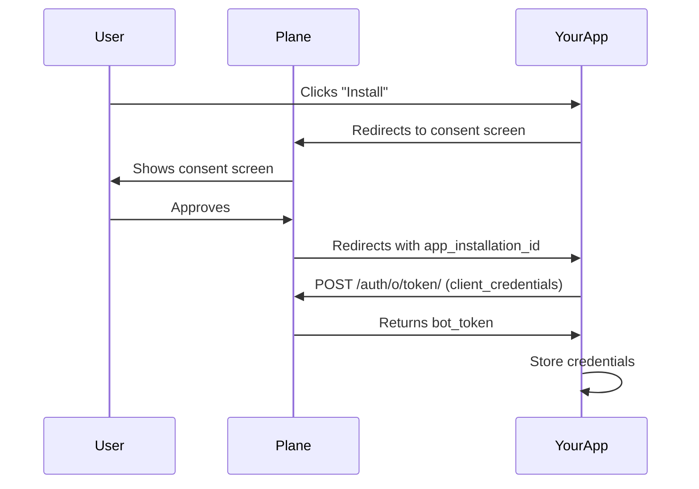
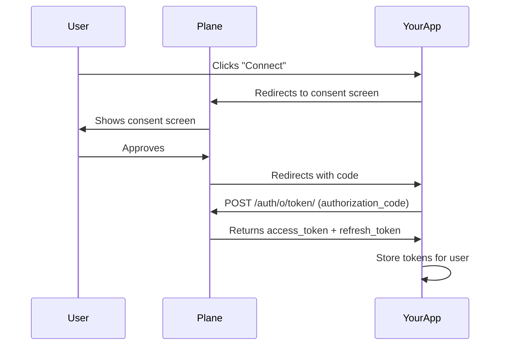

# Choose token flow

Plane supports two OAuth flows:

| Flow                                | Use When                                       | Token Type     |
| ----------------------------------- | ---------------------------------------------- | -------------- |
| **Bot Token** (Client Credentials)  | Agents, webhooks, automation, background tasks | `bot_token`    |
| **User Token** (Authorization Code) | Actions on behalf of a specific user           | `access_token` |

::: info
Most integrations should use the **Bot Token flow**. Use User Token only when you need to perform actions as a specific user.
:::

---

## Bot token flow

Use this flow for agents, webhook handlers, and automation that acts autonomously.



### 1. Redirect to authorization

When a user clicks "Install", redirect them to Plane's consent screen:

```
GET https://api.plane.so/auth/o/authorize-app/
  ?client_id=YOUR_CLIENT_ID
  &response_type=code
  &redirect_uri=https://your-app.com/callback
```

### 2. Handle the callback

After the user approves, Plane redirects to your Redirect URI with:

| Parameter             | Description                               |
| --------------------- | ----------------------------------------- |
| `app_installation_id` | Unique identifier for this installation   |
| `code`                | Authorization code (not used in bot flow) |

### 3. Exchange for bot token

```
POST https://api.plane.so/auth/o/token/
Content-Type: application/x-www-form-urlencoded
Authorization: Basic base64(client_id:client_secret)

grant_type=client_credentials
&app_installation_id=APP_INSTALLATION_ID
&scope=scopeA scopeB scopeC
```

**Response:**

```json
{
  "access_token": "pln_bot_xxxxxxxxxxxx",
  "token_type": "Bearer",
  "expires_in": 86400,
  "scope": "scopeA scopeB scopeC"
}
```

### 4. Get workspace details

```
GET https://api.plane.so/auth/o/app-installation/?id=APP_INSTALLATION_ID
Authorization: Bearer YOUR_BOT_TOKEN
```

**Response:**

```json
[
  {
    "id": "installation-uuid",
    "workspace": "workspace-uuid",
    "workspace_detail": {
      "name": "My Workspace",
      "slug": "my-workspace"
    },
    "app_bot": "bot-user-uuid",
    "status": "installed"
  }
]
```

Store the `workspace_detail.slug` for API calls and `app_installation_id` for token refresh.

### 5. Refresh bot token

Bot tokens expire. Request a new one using the stored `app_installation_id`:

```
POST https://api.plane.so/auth/o/token/
Content-Type: application/x-www-form-urlencoded
Authorization: Basic base64(client_id:client_secret)

grant_type=client_credentials
&app_installation_id=APP_INSTALLATION_ID
&scope=scopeA scopeB scopeC
```

---

## User token flow

Use this flow when your app needs to act on behalf of a specific user.



### 1. Redirect to authorization

```
GET https://api.plane.so/auth/o/authorize-app/
  ?client_id=YOUR_CLIENT_ID
  &response_type=code
  &redirect_uri=https://your-app.com/callback
  &state=RANDOM_STATE_VALUE
  &scope=scopeA scopeB scopeC
```

::: info
Include a random `state` parameter to prevent CSRF attacks. Verify it matches when handling the callback.
:::

### 2. Handle the callback

After approval, Plane redirects to your Redirect URI with:

| Parameter | Description                                |
| --------- | ------------------------------------------ |
| `code`    | Authorization code to exchange for tokens  |
| `state`   | Your state parameter (verify this matches) |

### 3. Exchange code for tokens

```
POST https://api.plane.so/auth/o/token/
Content-Type: application/x-www-form-urlencoded

grant_type=authorization_code
&code=AUTHORIZATION_CODE
&client_id=YOUR_CLIENT_ID
&client_secret=YOUR_CLIENT_SECRET
&redirect_uri=https://your-app.com/callback
```

**Response:**

```json
{
  "access_token": "pln_xxxxxxxxxxxx",
  "refresh_token": "pln_refresh_xxxxxxxxxxxx",
  "token_type": "Bearer",
  "expires_in": 86400,
  "scope": "scopeA scopeB scopeC"
}
```

### 4. Refresh user token

```
POST https://api.plane.so/auth/o/token/
Content-Type: application/x-www-form-urlencoded

grant_type=refresh_token
&refresh_token=YOUR_REFRESH_TOKEN
&client_id=YOUR_CLIENT_ID
&client_secret=YOUR_CLIENT_SECRET
```

---

## Making API requests

Include the token in the `Authorization` header:

```
GET https://api.plane.so/api/v1/workspaces/{workspace_slug}/projects/
Authorization: Bearer YOUR_TOKEN
```

See the [API Reference](/api-reference/introduction) for available endpoints.
